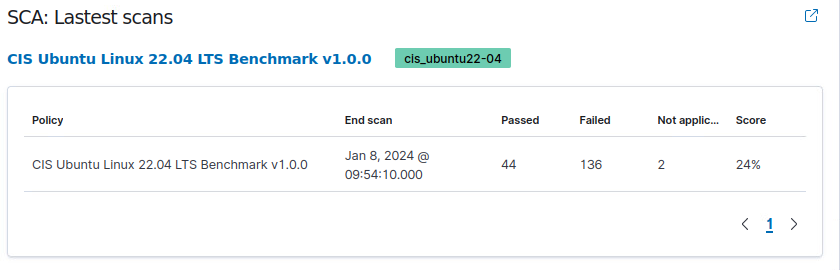
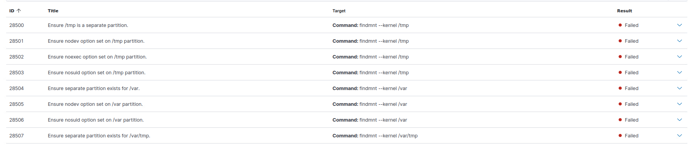
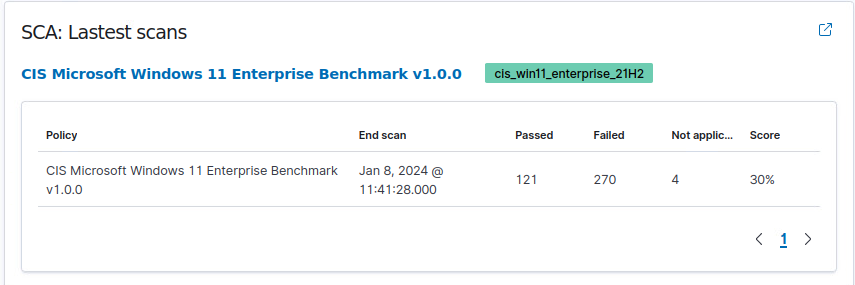
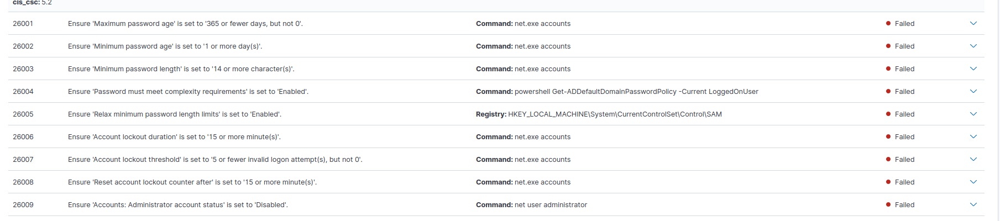

> Alle Befehle etc. wurden 1:1 wie im Arbeitsblatt durchgeführt, und werden als solches auch nicht dokumentiert. 
> In dieser Dokumentation finden sich folglich jene Teile, welche nicht übernommen wurden.

# Zugriffsdaten

Username: admin
Password: .WITTAg*zwa0nBcetttw8hY37s+iBoPP

# CIS-Benchmark

CIS-Benchmarks, oder Center for Internet Security-Benchmarks, sind bewährte Konfigurationsrichtlinien für die Sicherheit von Computersystemen, Netzwerken und Anwendungen. Sie werden vom Center for Internet Security (CIS) entwickelt und bieten detaillierte Anleitungen zur sicheren Konfiguration von Software und Hardware.

Diese Benchmarks sind in verschiedenen Kategorien unterteilt, darunter Betriebssysteme, Datenbanken, Webbrowser und mehr. Die Richtlinien sind darauf ausgerichtet, Schwachstellen zu minimieren und eine robuste Sicherheitskonfiguration zu gewährleisten. Sie basieren auf bewährten Methoden und branchenweiten Standards, um Organisationen bei der Verbesserung ihrer Sicherheitsposture zu unterstützen.

Die Umsetzung von CIS-Benchmarks kann Organisationen helfen, ihre Systeme gegen eine Vielzahl von Bedrohungen zu schützen, indem sie Sicherheitslücken minimieren und eine konsistente Sicherheitskonfiguration fördern. Es ist wichtig, die Benchmarks regelmässig zu überprüfen und anzupassen, da sich Bedrohungen und Sicherheitsanforderungen im Laufe der Zeit ändern können.

# Scans Linux

Einige der Probleme:

# Scans Windows

Einige der Probleme:

